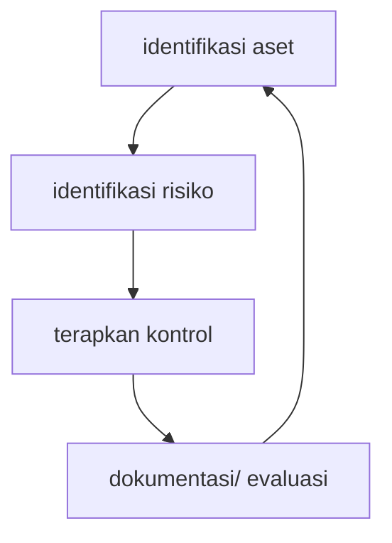

# SecuringSME

## About

Repo ini merupakan pendamping pembahasan SecuringSME

## Cara kerja

## Katalog Kontrol

Katalog kontrol bersumber dari [NCSC small business guide](https://www.ncsc.gov.uk/collection/small-business-guide), [NIST small medium business quick start guide](https://csrc.nist.gov/pubs/sp/1300/final), dan [CIS small medium enterprise guide](https://www.cisecurity.org/insights/white-papers/cis-controls-sme-guide)

## Appendix

- [scripts](/scripts/scripts.md)
- [benchmarks](/benchmarks/benchmarks.md)
